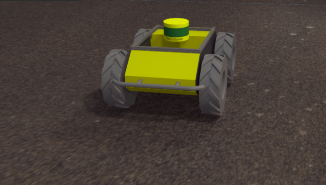
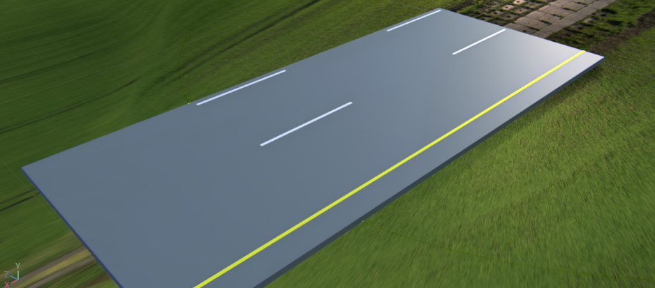
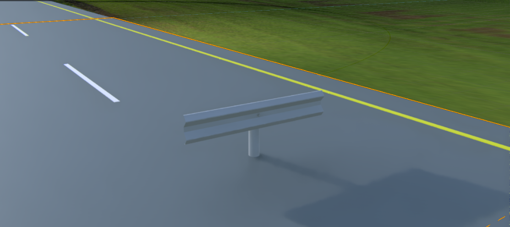
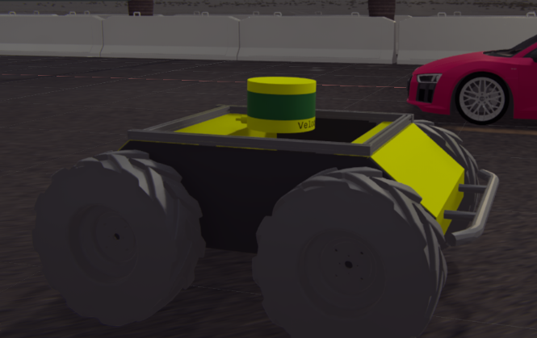

# Road Making Demo Repo

This is the repo made for demonstration of automatic road making system.

The basic elements of the testing simulation environment includes road pices, barriers and the robot:

<table>
<td width="33%"></td>
<td width="33%"></td>
<td width="33%"></td>
</table>

Each of these elements are provided with a preview image in corresponding folder. Where for barriers we have two types, either steel type or concrete type.

During testing, these elements are used to create a customized road depend on evaluation needs.